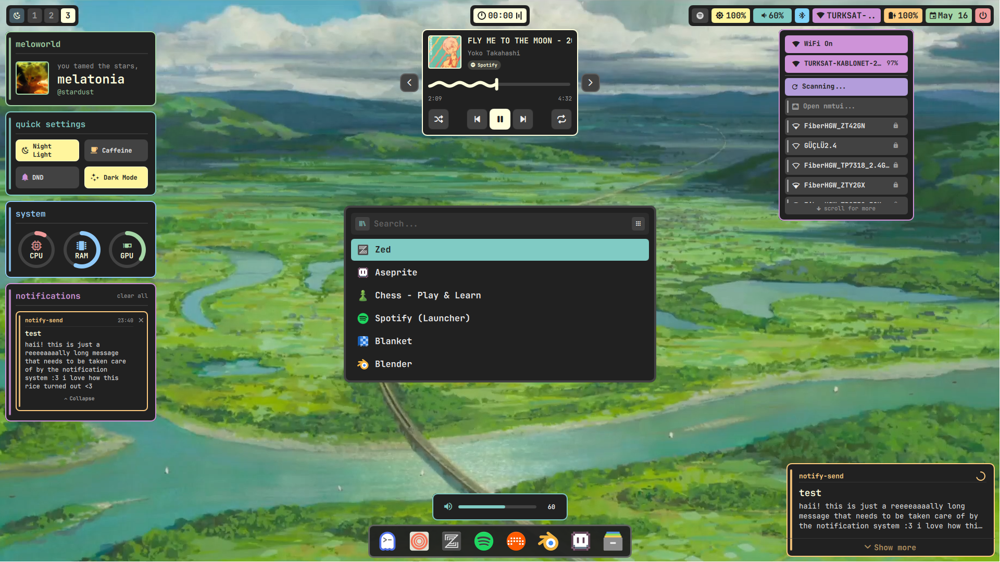
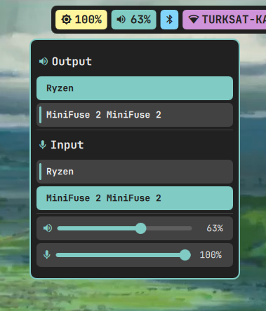
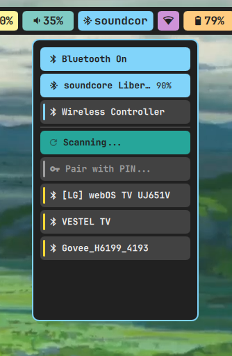
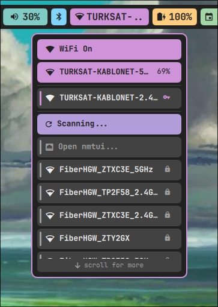
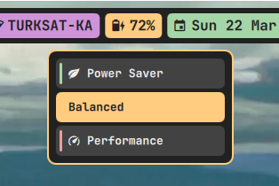
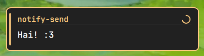

<div align="center">

# 🌿 meloworld

*a rice that feels like /home <3*


</div>

---



---

## 🌱 about

Meloworld is my personal Arch Linux desktop. built around MangoWM and Quickshell, written in QML. the wallpapers are ghibli landscapes and the whole thing is meant to feel warm, colorful, and alive — not cold and minimal.

every popup, widget, and notification is part of the same visual system. same row height, same font, same spacing throughout. things slide in, things slide out.

---

## 🍃 the setup

| | |
|---|---|
| **os** | Arch Linux |
| **wm** | MangoWM |
| **shell layer** | Quickshell 0.2.1 |
| **terminal** | Ghostty |
| **shell** | zsh |
| **editor** | Helix |
| **launcher** | Rofi |
| **font** | JetBrainsMono Nerd Font |
| **wallpaper** | Ghibli landscapes |
| **screenshots** | grim + slurp |

---

## 🌸 the bar

workspace pills that slide in when you open something and slide out when you close it. scroll the mouse wheel to switch workspaces. a clock in the center. audio, bluetooth, power profile, network, battery, date, and session on the right.

---

## 🪴 the popups

three popups. all animated — slide down from the top when they open, slide back up when they close. all share the same design language so they feel like they belong together.

### 🔊 audio



device selection for output and input. volume and mic sliders side by side. click the icon to mute — everything dims when muted. if you only have one audio device, the selector hides itself.

### 🦷 bluetooth



paired devices, scan button, and a filtered scan list that hides raw MAC addresses so you're not staring at noise. the list caps at five entries and scrolls. tells you when there's more above or below.

### 🛜 wifi



previously connected networks, autoscan, password enter field. similar to bluetooth the list caps and scrolls.

### ⚡ power profile



it uses power-profiles-daemon. the border changes color with whatever's active.

---

## 🌻 notifications



slide in from the right. each app gets its own accent color, derived from the app name — so the same app always gets the same color. critical notifications go red regardless. there's a small timer ring that drains as the notification ages. hover to pause. click to dismiss.

---

## 🌾 install

# Still work in progress, trying to create an installer script!

```bash
git clone https://github.com/melatonia/meloworld-dotfiles
cd meloworld-dotfiles

cp -r quickshell ~/.config/
cp -r mango ~/.config/
cp -r ghostty ~/.config/
cp -r hypr ~/.config/
cp -r rofi ~/.config/
cp -r zed ~/.config/
cp -r .zshrc ~/.zshrc
sudo cp -r meloworld-sddm /usr/share/sddm/themes/
```

you can use this code to remove window buttons from apps.
```bash
gsettings set org.gnome.desktop.wm.preferences button-layout ":"
```

### dependencies

```bash
paru -S mangowm quickshell pipewire pipewire-pulse wireplumber bluez bluez-utils brightnessctl ghostty power-profiles-daemon polkit-gnome ttf-jetbrains-mono-nerd rofi rofi-emoji grim slurp awww bibata-cursor-theme-bin papirus-icon-theme zed zsh zsh-autosuggestions zsh-syntax-highlighting

sudo systemctl enable --now bluetooth power-profiles-daemon
```

> ⚠️ use Quickshell **0.2.1 from the extra repo** — not the git version. the API is different and things will break.

---

## 🍀 credits

the popup design language — the row style, the accent stripes, the device selectors — was heavily inspired by [crylia-theme](https://github.com/Crylia/crylia-theme) by [Crylia](https://github.com/Crylia). a beautiful AwesomeWM rice that made the whole thing feel possible. everything here is reimplemented from scratch in QML, but the soul came from there.

go leave them a star! ⭐

---

<div align="center">

*all the world is lucky to be your home* 🌿

</div>
