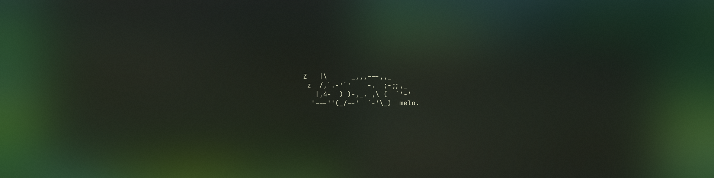
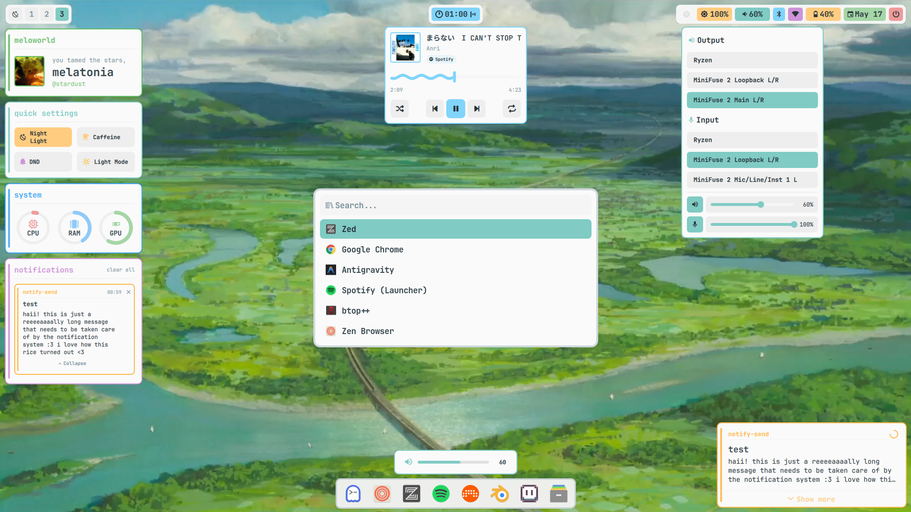
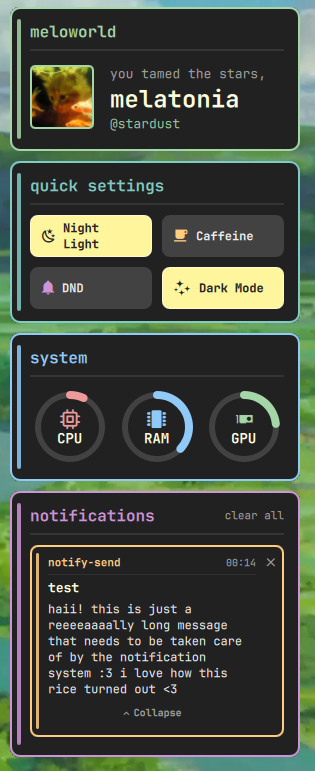
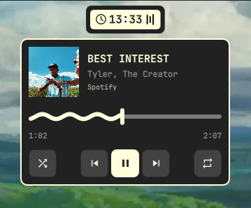
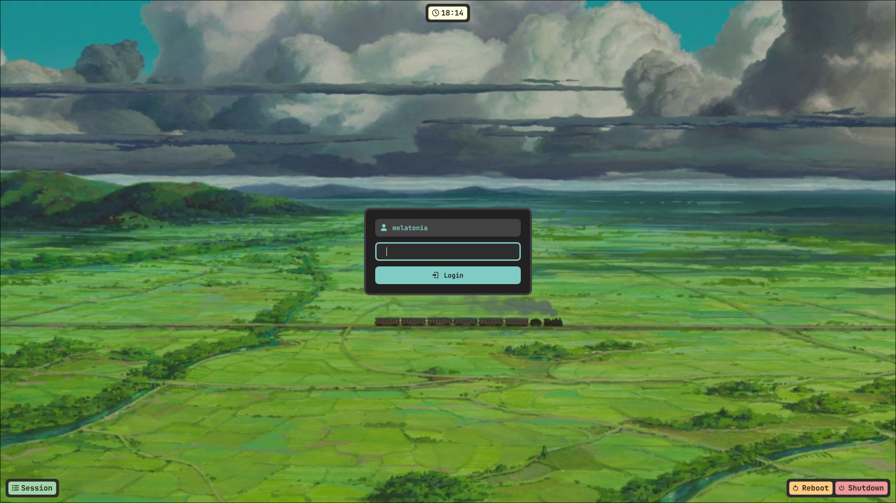
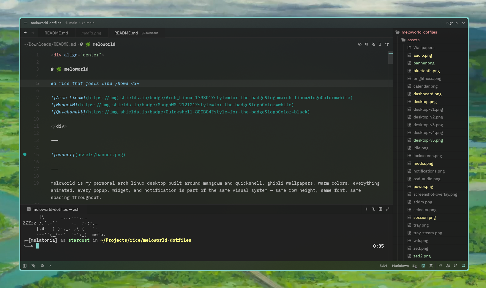
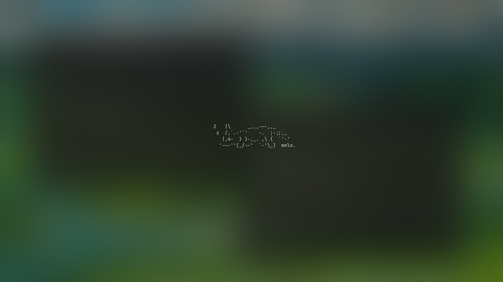

<div align="center">

# 🌿 meloworld

*a rice that feels like /home <3*

</div>

---



---


<details>
<summary>☀️ light mode</summary>
<br>



</details>

---

meloworld is my personal arch linux desktop built around mangowm and quickshell. ghibli wallpapers, warm colors, everything animated. every popup, widget, and notification is part of the same visual system. same row height, same font, same spacing throughout.

| | |
|---|---|
| **os** | Arch Linux |
| **wm** | [MangoWM](https://github.com/mangowm/mango) |
| **shell layer** | [Quickshell](https://quickshell.org/) |
| **launcher** | Rofi |
| **terminal** | [Ghostty](https://ghostty.org/) |
| **shell** | zsh |
| **editor** | [Zed](https://zed.dev/) |
| **font** | [JetBrainsMono Nerd Font](https://www.nerdfonts.com/) |

---

## 🌸 features

<details>
<summary>🪟 bar & workspaces</summary>
<br>

workspace pills slide in when you open something and slide out when you close it. scroll the mouse wheel to switch workspaces. all status pills on the right open their respective popups.

</details>

<details>
<summary>☀️ dashboard</summary>
<br>



a left panel with quick toggles, system stats, and notification history. greetings change dynamically based on the time of day.

</details>

<details>
<summary>🪴 popups</summary>
<br>

all animated — slide down from the top when they open, slide back up when they close. all share the same design language.

**🎼 media player**



supports shuffle and repeat on supported apps. uses the material expressive 3 progress bar. switches between players with chevron arrows.

---

**🔊 audio**


device selection for output and input. volume and mic sliders side by side. click the icon to mute — everything dims when muted. single-device setups hide the selector automatically.

---

**🦷 bluetooth**


paired devices, scan button, filtered scan list that hides raw MAC addresses. list caps at five entries and scrolls — tells you when there's more above or below.

---

**🛜 wifi**


previously connected networks, autoscan, password entry. same scrolling behavior as bluetooth.

---

**⚡ power profile**


uses power-profiles-daemon. the border changes color with whatever profile is active.

</details>

<details>
<summary>🌻 notifications</summary>
<br>


slide in from the right. each app gets its own accent color derived from the app name — same app always gets the same color. critical notifications go red regardless. a small timer ring drains as the notification ages. hover to pause. click to dismiss.

</details>

<details>
<summary>🔑 sddm & lockscreen</summary>
<br>



a custom sddm theme built on the same aesthetic so the login screen feels like part of the desktop rather than something bolted on.

</details>

<details>
<summary>🧑🏼‍💻 zed theme</summary>
<br>



matches the same color palette. blurred and non-blurred variants included.

</details>

<details>
<summary>🌙 idle screen</summary>
<br>



a sleeping cat appears after a few minutes of inactivity. dims the screen, breathing animation, animated z's. any input dismisses it with a fade.

</details>

---

## 🍁 install

**automatic (arch linux)**

```bash
git clone https://github.com/melatonia/meloworld-dotfiles
cd meloworld-dotfiles
chmod +x install.sh
./install.sh
```

<details>
<summary>manual install</summary>
<br>

```bash
git clone https://github.com/melatonia/meloworld-dotfiles
cd meloworld-dotfiles

cp -r quickshell ~/.config/
cp -r mango ~/.config/
cp -r ghostty ~/.config/
cp -r hypr ~/.config/
cp -r rofi ~/.config/
cp -r zed ~/.config/
cp -r .zshrc ~/.zshrc
sudo cp -r meloworld-sddm /usr/share/sddm/themes/
```

add to `/etc/sddm.conf.d/theme.conf`:
```
[Theme]
Current=meloworld-sddm
```

remove window buttons from gtk apps:
```bash
gsettings set org.gnome.desktop.wm.preferences button-layout ":"
```

</details>

<details>
<summary>dependencies</summary>
<br>

```bash
paru -S mangowm quickshell pipewire pipewire-pulse wireplumber bluez bluez-utils brightnessctl ghostty power-profiles-daemon polkit-gnome ttf-jetbrains-mono-nerd rofi rofimoji grim slurp awww bibata-cursor-theme-bin papirus-icon-theme zed zsh zsh-autosuggestions zsh-syntax-highlighting adw-gtk-theme xdg-desktop-portal-wlr hypridle playerctl

sudo systemctl enable --now bluetooth power-profiles-daemon
```

</details>

---

## 📦 extras

the sound files (login chime, notification, screenshot, usb connect/remove) were made by me in bitwig studio. use them freely, a credit would be appreciated :3

i use zen browser with the [transparent zen extension](https://sameerasw.com/zen) and `#212121CC` background. for firefox, [Firefox Gnome Theme](https://github.com/rafaelmardojai/firefox-gnome-theme) works well.

---

## 🍀 credits

the popup design language — row style, accent stripes, device selectors — was heavily inspired by [crylia-theme](https://github.com/Crylia/crylia-theme) by [Crylia](https://github.com/Crylia). a beautiful awesomewm rice that made the whole thing feel possible. everything here is reimplemented from scratch in qml, but the soul came from there.

go leave them a star! ⭐

---

<div align="center">

*all the world is lucky to be your home* 🌿

</div>
